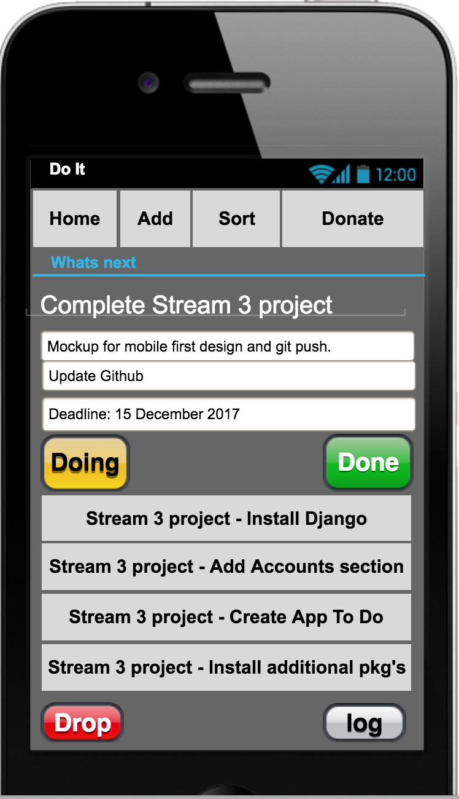

Stream 3 Django project 

Purpose: 
This is a lightweight app that allows users to login and configure their own workflow similar to a KanBan board with a focus on doing one task at a time until it is fully completed. 

Needs it fulfils: 
Put an end to multitasking, by using a lightweight easy to configure workflow app. 

Functionality: 
Login create items/tasks for projects, and organise by priority to show what needs to be done next. 
A shopping cart will be used for a donation page for the public to use in non commercial environments. 
Permission for commercial use of the app is to be decided. 

User Interface (UI): 
Register, Log In, Log Out, Create Item in an easy manner with no clutter to not waste time. 
Mobile first approach, with ability to display more on larger screens. 

User Experience (UX): 
Each user will have the functionality brought by the implementation of the Dragula library to allow users to drag a new item/task into their WIP bin. 
Minimal style design that is easy to read. 

Technologies used: 
Django, Bootstrap, Pencil, Dragula JS, Stripe, HTML5, CSS3, Python3, SQL Database

Deployment method: 
Heroku 

Testing: 
Accounts app    Generic test to test the testing system - Addition is Equal.
                Generic test to test the testing system - Addition is NotEqual.
                Registration test with valid details.
                Registration test with missing second password.
                Registration test with not matching passwords.

ToDoItem app    Resolves to the home page
                Resolves without error to index.html
                Create a to do item

Manual testing has been done for the credit card payments. Since deployment these settings wont change from pushes to GitHub as they are stored as config variables on Heroku.

Accreditation: 
Dragula 
https://bevacqua.github.io/dragula/
 
  
A lot of customisation was done to the core Dragula files including increasing the amount of columns, adding an Ajax call on drop to update the database with a status change, and styling.
The core drag and drop functionality was used to style the front end and contribute to UX and UI. 

Mockup file changed drastically upon deciding to go for drag and drop functionality: 

 
  
List of Django reusable app components: 
* Accounts    Authentication mechanism for users to register, login, logout, and view profile.
* To Do Item  App functionality for task management, specific to the logged in user.
* Donations   Products page, where different types of donations are the products.
* Cart        Shopping cart functionality, ability to adjust quantities before committing to the checkout payment.
* Checkout    Pay for cart using Stripe to fulfil e-commerse payments.
